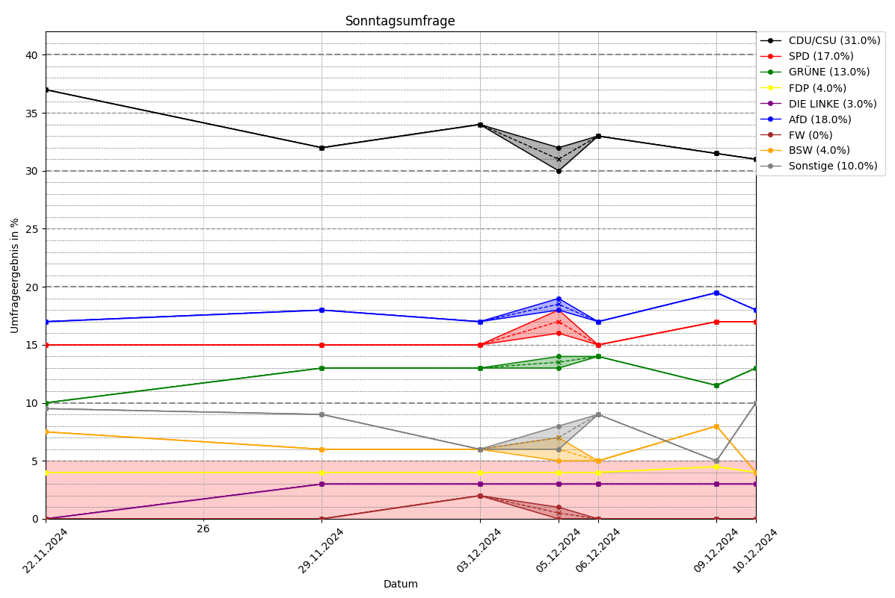

# Sonntagsfrage Scraper

SonntagsfrageScraper is a lightweight and efficient tool for scraping, analyzing, and visualizing public opinion poll data related to the "Sonntagsfrage" (a recurring German political opinion poll). This repository provides tools to collect data, process it into a structured format, and create insights that are easy to interpret.

## GitHub Page

The latest visualizations and data are available on the GitHub Page:
[SonntagsfrageScraper GitHub Page](https://tobiwein.github.io/SonntagsfrageScraper/)

## Features

**Automated Scraping**: Retrieves data from specified polling sources.

**GitHub Action for Weekly Updates**: Automatically updates the data weekly using a GitHub Action on the auto_data_update branch.

**Data Processing**: Cleans and structures raw data for analysis.

**Visualization**: Generates meaningful graphs and charts for better understanding trends over time.

**Customizable**: Easily adaptable to include new data sources or modify visualization preferences.

## Data Storage

The scraped data is stored in a simple, human-readable format that organizes polling results chronologically. Each entry represents the results of a poll conducted on a specific date, followed by the percentages for each political party or grouping. The data is structured as key-value pairs, where the party names are the keys, and the values are tuples containing the poll percentages (`min`, `max` values).

```
22.11.2024
CDU/CSU: (37.0, 37.0)
SPD: (15.0, 15.0)
GRUENE: (10.0, 10.0)
...
29.11.2024
CDU/CSU: (32.0, 32.0)
SPD: (15.0, 15.0)
GRUENE: (13.0, 13.0)
...
```

This format makes it easy to parse, update, and analyze the data programmatically while maintaining simplicity for manual inspection.

## GitHub Actions

The repository includes a scheduled GitHub Action configured to run weekly on the `auto_data_update` branch. This action fetches the latest data and ensures the repository stays up-to-date without manual intervention.

To see the action logs or status, visit the Actions tab.

## Requirements

**Python 3.8+**

### Libraries:

- `requests`
- `pandas`
- `matplotlib`
- `beautifulsoup4`
- `python-dotenv`
- `plotly`

(Add any other libraries your project uses)

## Installation

1. Clone the repository:
    ```sh
    git clone https://github.com/tobiwein/SonntagsfrageScraper.git
    cd SonntagsfrageScraper
    ```

2. Install the required dependencies:
    ```sh
    pip install -r requirements.txt
    ```

## Usage

1. Run the scraper to fetch the latest data:
    ```sh
    python scrape.py
    ```

2. Process the data and create visualizations:
    ```sh
    python analyze.py
    ```

3. Generate the HTML page for the GitHub page:
    ```sh
    python page_update.py
    ```

## Example Output



## Contribution

Contributions are welcome! If you have suggestions for new features or want to improve existing functionality, feel free to open an issue or submit a pull request.

1. Fork the repository.

2. Create a new branch (feature/my-feature).

3. Commit your changes.

4. Push to your branch and create a pull request.

## License

This project is licensed under the MIT License.

## Contact

For questions or feedback, feel free to reach out via the repository's Issues page.
